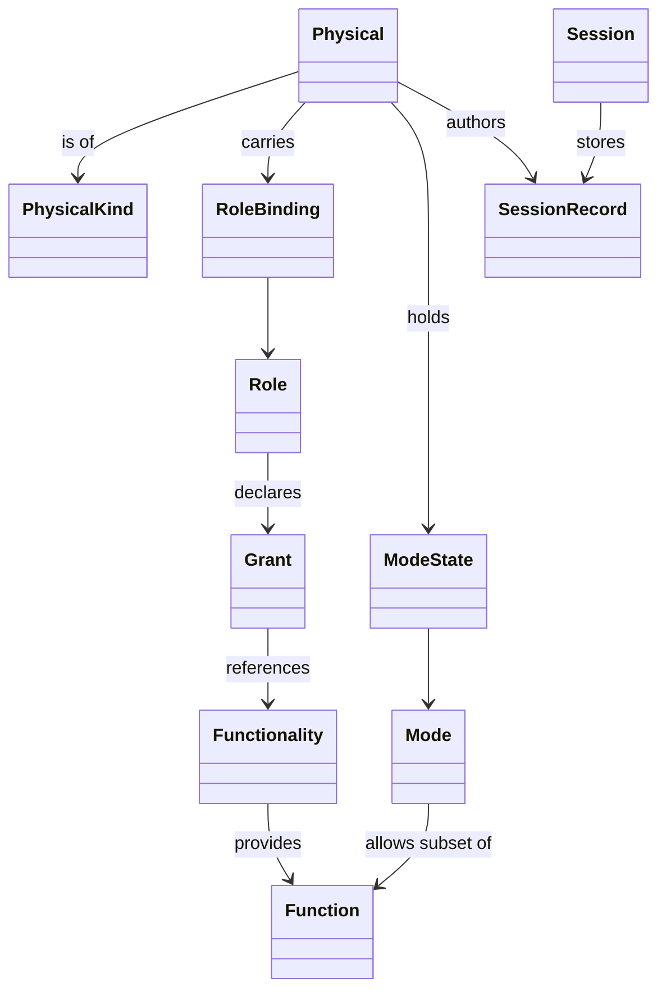

# Object model — physicals, roles, functionalities, modes, sessions

Status: **design only, no code.** This is the class-level companion to
`ARCHITECTURE.md`. That document describes the *layers* and the flow of
control; this one describes the *objects* and their inheritance, taking
your five nouns (physical, role, functionality, mode, session) as the
spine.

Rule for the whole document: every noun that could ever have a second
variant is an **abstract class with a registry**, and every thing that
could ever be added by a designer rather than a programmer is a
**descriptor** — data, not a subclass. Subclass when *behaviour*
differs; descriptor when only *configuration* differs.

---

## 0. Where this stands relative to the current code

`app.ts` (5654 lines) already contains, in flat form, most of what the
model below names. The migration is mostly a matter of giving existing
concepts a home:

| Today in `app.ts`                   | Becomes                            |
| ----------------------------------- | ---------------------------------- |
| `templates[]`, `Tpl`, `TPL_FACTORY` | `PhysicalKind` descriptors         |
| `recognise()`, `matchRing()`, `describe()` | `FootprintMatcher` subclasses |
| `tracks`, `startTrack()`, `puckMemory` | `Tracker`, `Track`, `Presence`  |
| `t.topicIdx`, `ringItems()`, `openPuckRing()` | `ModeState` + `MenuComposer` |
| `isToolPuck()`, `t.nest`, `mayOverlap()` | `DuoInsert` + `Affordance`    |
| `pins[]`, `dropPin()`, `save()`     | `Mark` + `SessionRepository`       |
| `talk`, `capture.ts`                | `Recording` subclasses + services  |
| `MV`, `TILE_SETS`, `buildLayerMenu()` | `MapView`, `Layer`, `LayerStack` |
| `simPucks`, `simMode`               | `VirtualPhysical`                  |
| `learn.*`                           | `KindLearner` (authoring, not runtime) |

Nothing in that column is thrown away; it is redistributed.

---

## 1. The five nouns as class families



Read it as one sentence: *a physical of some kind carries one role and
holds one mode; the role references functionalities that provide
functions; the mode narrows those functions; everything that results is
stored in the session, stamped with the physical that authored it.*

### 1.1 Where this model departs from your notes

Five deliberate changes, each because the note as written would cost
code later:

1. **Physical splits in two** — `PhysicalKind` (what was manufactured)
   and `Physical` (what is on the glass right now). Your "unique ID"
   belongs to the instance, "duo / filled / open / sticker" to the kind.
2. **"How many?" is two questions** — how many of this object exist, and
   how many may hold this role at once. Both become a `Cardinality`
   object with an explicit policy for what happens on the third one.
3. **Function 10 disappears** — "edit all paths" is "edit path" with
   `scope: all`. Scope is a property of the grant, not a second verb.
   The same reasoning collapses 1+3 into one `MapNavigation`
   functionality without merging the functions themselves.
4. **Mode and phase are separated** — your mode is per puck; the table
   also needs a table-wide narrowing (everyone votes now). Same
   mechanism, different owner.
5. **The duo insert is not a role** — it modifies the host's function
   set while nested. Otherwise every role needs a duo variant.

---

## 2. Sensing — below the model (`input/`)

Nothing here knows what a puck means.

- `ContactPoint` — value object: id, x, y, radius, firstSeen, lastSeen.
- `ContactFrame` — all contacts for one animation frame.
- **`Footprint`** *(abstract)* — the geometric signature of the contacts
  that belong to one object; `span()`, `centre()`, `orientation()`.
  - `RingFootprint` — n feet on one circle, described by gap angles.
  - `PolygonFootprint` — 3–4 feet, described by side ratios.
  - `PointFootprint` — a single finger; no identity.
  - `CodeFootprint` — a printed/sticker pattern read as a symbol.
- **`FootprintMatcher`** *(abstract)* — `match(frame): Candidate[]`.
  - `RingMatcher`, `RatioMatcher`, `NestMatcher`, `CodeMatcher`.
  - `MatcherChain` — composite; ordered, first confident wins, with an
    explicit `Ambiguous` outcome (never "the second best").
- `Candidate` — kindId + pose + confidence + margin over runner-up.
- `Tracker` / `Track` / `TrackMemory` — turn per-frame candidates into a
  stable identity across dropouts.
- `Pose` — x, y, angle, scale, confidence. Immutable.
- **`Gesture`** *(abstract)* — `Tap`, `DoubleTap`, `LongPress`, `Drag`,
  `Rotate`, `Pinch`, `Place`, `Lift`, `Nest`, `Unnest`.
  - `GestureRecognizer` *(abstract)* per gesture family.
- `InputSignature` — declarative "what gesture, on what target, from
  what physical class". Published by functions, matched by the router.
  **This is the seam that lets a new role work without input changes.**

All geometry (circle fitting, gap angles, hit tests) belongs in the Rust
crate and is reached through one `GeometryBridge` façade.

---

## 3. Physicals (`physicals/`)

### 3.1 Kind — what a thing *is*

`PhysicalKind` is a descriptor, one entry per manufactured object:

```
PhysicalKind
  id            "open-ring-a" | "duo-host" | "sticker-07"
  footprint     FootprintSpec        (ring radius, gap angles, ratios)
  geometry      radiusMM, apertureMM, heightMM
  affordances   [Affordance]
  defaultRole   RoleId?
  cardinality   Cardinality          <- "how many?" for the object itself
  appearance    colour, face label, sticker artwork ref
```

**`Affordance`** *(abstract)* — what the object physically permits,
which is *not* the same as what its holder is allowed to do:

- `Rotatable` — orientation is meaningful (zoom, menu opening).
- `Apertured` — has a hole you can see and tap through (open puck).
- `Nestable` / `Nesting` — the duo pair; carries `mayOverlap`.
- `Opaque` — covers the map, so panels must dodge it.
- `Coded` — carries a printed identity (sticker) rather than feet.
- `Passive` — no menu of its own; acts only as a target.

Separating affordance from permission is the single most useful
abstraction here: `Apertured` says a hole-tap is *possible*,
`FunctionSet` says it is *allowed*, and the two never have to know
about each other.

### 3.2 Instance — a thing on the glass

```
Physical (abstract)
  id            PhysicalId           <- unique, stable, survives lifting
  kind          PhysicalKind
  pose          Pose?
  presence      Presence
  role          RoleBinding          <- exactly one
  mode          ModeState            <- exactly one, current
  authoredIds   Set<RecordId>        <- what it made, for scope: own
  functions()   FunctionSet          <- derived, cached
```

Hierarchy:

```
Physical
├── TangibleObject (abstract)      on the glass, has a Pose
│   ├── Puck (abstract)
│   │   ├── FilledPuck             solid face, ring menu on the rim
│   │   ├── OpenPuck               apertured; map visible through it
│   │   └── DuoPuck (composite)
│   │       ├── DuoHost            the outer body, carries the role
│   │       └── DuoInsert          the nesting tool; a *modifier*
│   └── StickerObject              coded, usually Passive
├── Finger                         anonymous, transient, zone-bound
├── HardwareControl (abstract)
│   ├── ResetButton
│   └── KeyboardControl
└── VirtualPhysical (abstract)     same interface, no contacts
    ├── SimulatedPuck              dev/sim mode
    ├── SystemPhysical             the table itself: timers, autopull
    └── RemotePhysical             phone / second screen, later
```

`SystemPhysical` matters more than it looks: modelling the table as a
physical means automatic changes (phase timeout, kiosk recovery) enter
the session through the same funnel and appear in the journal like any
human action. No second code path for "the system did it".

`DuoInsert` is deliberately **not a role**. It is a
`CapabilityModifier`, an object that adds/swaps functions on the host
while nested and removes them when separated. That keeps "two discs may
lie on each other" a physical fact and "this puck may now edit all
paths" a permission fact.

### 3.3 Presence

```
Presence (state machine)
  Unseen → Placed → Lifted → Placed        (recovery within memoryMS)
                  ↘ Gone                   (memory expired)
```

An actor **persists while lifted**: its marks, colour, mode and
authorship survive a puck being picked up and put back. `PresencePolicy`
holds the timeout so it is one value in one place.

### 3.4 Registries

- `PhysicalRegistry` — the live set; emits `joined`, `left`,
  `roleChanged`, `modeChanged`.
- `IdentityMap` — footprint/code → `PhysicalId` → default `RoleId`. One
  constants file; physical reality lives in exactly one place.
- `KindRegistry` — all `PhysicalKind`s, including learned ones.
- `KindLearner` — authoring-time: measure a new object, propose a kind,
  detect clashes with existing kinds. Never used at runtime.

---

## 4. Roles (`roles/`)

A role is a **descriptor**, so a new role is an entry, not a class.

```
Role
  id            "supervisor" | "player" | "navigator" | ...
  label         per language
  extends       [RoleId]            <- the only inheritance, by reference
  grants        [Grant]
  revokes       [FunctionId]        <- narrow without a new base
  modes         [ModeId]            defaultMode
  cardinality   Cardinality         <- "how many pucks may hold this"
  appearance    RoleSkin
```

```
Grant
  target        FunctionalityId | FunctionId
  scope         Scope
  params        function-specific limits
```

**`Scope`** *(abstract)* — `permits(actor, target): boolean`:

- `OwnScope` — target.authorId == actor.id
- `AllScope` — anything
- `ZoneScope(zone)` — inside one area
- `RoleScope(roleId)` — things authored by a given role
- `NoneScope` — read-only

Scope is a property of the *grant*, not a separate function. "Player
edits own paths, supervisor edits all paths" is **one** function with
two grants — which also resolves the duplication in your list between
function 4 (edit own path) and 10 (edit all paths).

Supporting classes:

- `RoleRegistry` — flattens `extends` chains, detects cycles, the only
  place that knows role ids.
- `RoleBinding` — the link physical→role, plus its `BindingSource`:
  `FromIdentity` (the sticker says so), `FromHandover` (a supervisor
  assigned it), `FromPhase` (this phase turns every player into a
  voter), `FromFallback`.
- `RoleAssignmentPolicy` — enforces `Cardinality` at binding time.

### 4.1 Cardinality — your open "how many?"

```
Cardinality
  min, max      0 | 1 | n | ∞
  onExceed      OverflowPolicy
```

**`OverflowPolicy`** *(abstract)*: `Reject` (the puck lights red and
does nothing), `EvictOldest` (newest supervisor wins), `Queue` (waits
until a slot frees), `DegradeTo(roleId)` (a fifth navigator becomes a
player). Making this an object means the decision is a one-line change
per role rather than a rewrite.

Two different cardinalities exist and should not be confused:

- on `PhysicalKind` — how many copies of this object exist in the box;
- on `Role` — how many present physicals may hold this role at once.

Draft answers: supervisor `max 1, Reject`; navigator `max 2`; player
`∞`; voter `∞`; system operator `max 1`; team lead `max 1 per team`
(which implies a `Team`/`Zone` axis — see §9, open question 3).

---

## 5. Functionality and Function (`functions/`)

Three levels, because your model has three:

```
Role ──grants──> Functionality ──provides──> Function ──plans──> Command
```

**`Functionality`** *(abstract)* — a **container class**: it owns the
state, the policies and the verbs that belong together, and a role
receives the whole container rather than a handful of loose verbs. Map
control and settings control are exactly this — classes with classes
inside them, unfolded in §5.4.

```
Functionality (abstract)
  id
  state         the model it owns and nobody else writes
  policies      [Policy]        swappable rules, no loose numbers
  functions()   Function[]      nested, see §5.3
  requires()    ServiceId[]
  install(ctx)  / uninstall(ctx)
  snapshot()    read-only view for everyone else
```

The ten containers, each unfolded in §5.4:

| Functionality      | Owns                      | Functions (your numbering) |
| ------------------ | ------------------------- | -------------------------- |
| `MapControl`       | view, layers, tuning      | 1, 3, 9, presentation      |
| `SettingsControl`  | settings document, schema | 5, change, reset, calibrate|
| `MarkControl`      | marks                     | 2, move, annotate, relate  |
| `PathControl`      | paths                     | 4, 7, 10 (as scope), draw  |
| `VoteControl`      | ledger, rounds            | 8, retract, close round    |
| `CaptureControl`   | queue, media              | 6, audio, timelapse        |
| `KnowledgeControl` | graph, heat, selection    | inspect, relate, ask       |
| `SessionControl`   | session, phases           | phase, export, wipe        |
| `RoleControl`      | bindings                  | bind, hand over, set mode  |
| `SystemControl`    | health                    | reset, update, diagnose    |

**`Function`** *(abstract)* — the atomic verb, one file each:

```
Function (abstract)
  id            "map.navigate"
  targets       [EntityType]
  signature     InputSignature
  defaultScope  Scope
  menu          MenuSpec?          label, icon, ring position
  precondition(ctx): Verdict
  plan(intent):      Command
```

Your ten, as classes:

| # | Class                 | Id               | Notes                       |
| - | --------------------- | ---------------- | --------------------------- |
| 1 | `NavigateMapFunction` | `map.navigate`   | pan; drag or puck joystick  |
| 2 | `PlaceMarkFunction`   | `mark.place`     | authored, scoped            |
| 3 | `ZoomMapFunction`     | `map.zoom`       | rotate or pinch             |
| 4 | `EditPathFunction`    | `path.edit`      | scope decides own vs all    |
| 5 | `OpenSettingsFunction`| `session.settings` | opens a panel, not a mode |
| 6 | `CaptureMapFunction`  | `capture.make`   | photo/audio/timelapse param |
| 7 | `RenamePathFunction`  | `path.rename`    | could fold into `path.edit` |
| 8 | `VoteFunction`        | `vote.cast`      | one per zone per round      |
| 9 | `ChangeLayerFunction` | `map.layer`      |                             |
| 10| —                     | `path.edit@all`  | **not a class**: grant of 4 |

`Verdict` *(abstract)*: `Allowed` | `Denied(reason)` where reason is
itself an object (`NotGranted`, `OutOfScope`, `WrongMode`,
`PhaseBlocked`, `CardinalityFull`, `TargetLocked`) so the UI can explain
refusals without string matching.

`FunctionSet` — an immutable set with union / intersect / subtract, so
resolution is algebra rather than if-statements.

### 5.1 Role × function matrix (your table, normalised)

| Function        | Supervisor | Player | Navigator | Voter | Team lead | Reviewer | Sys. op |
| --------------- | ---------- | ------ | --------- | ----- | --------- | -------- | ------- |
| map.navigate    | ✔ | – | ✔ | – | – | ✔ | – |
| map.zoom        | ✔ | ✔ | ✔ | – | – | ✔ | – |
| map.layer       | ✔ | – | – | – | ✔ | – | – |
| mark.place      | ✔ | – | – | – | ✔ | – | – |
| path.edit       | all | own | – | – | own | – | all |
| path.rename     | ✔ | – | – | – | ✔ | ✔ | – |
| capture.make    | ✔ | – | – | – | ✔ | – | – |
| vote.cast       | ✔ | – | – | ✔ | – | – | ? |
| session.settings| ✔ | ✔ | – | – | ✔ | – | ✔ |

Two things this table makes visible, both worth deciding before code:
player having `session.settings` (5) but not `mark.place` (2) is
surprising, and reviewer/navigator differ by exactly one function
(`path.rename`) — a candidate for `reviewer extends navigator`.

### 5.2 Discrete and continuous functions

The draft above quietly assumed every function is one act. Half of yours
are not: navigating and zooming are a stream that starts, updates for
seconds and ends, and a stream cannot be modelled as a single command
without either flooding the journal or losing the shape of the movement.

So `Function` splits once, on that axis only:

```
Function (abstract)
├── DiscreteFunction        one gesture → one Command
│     mark.place, vote.cast, path.rename, capture.make,
│     session.settings, map.layer
└── ContinuousFunction      begin → update* → end → one Command
      map.navigate, map.zoom, path.edit (dragging a point)
        begin(intent):  Interaction
        update(sample): void
        end():          Command
```

`Interaction` *(abstract)* is the live object between begin and end:
`PanInteraction`, `ZoomInteraction`, `PathDragInteraction`. It owns its
own smoothing, dead zones and joystick easing — all the tuning that sits
loose in `CFG` today — and it is the thing a `Lock` is taken on.

Consequences, all of them wanted:

- The journal records `MapMoved(from, to, durationMs)`, not 400 frames.
- Cancelling is a real operation: lift the puck mid-pan and the
  interaction is discarded, not half-applied.
- Two physicals panning at once is now a visible collision between two
  `Interaction`s on one target, which the arbiter can settle later
  without any function knowing.
- Preview is free: an interaction renders itself before it commits.

### 5.3 The nesting rule — what may live inside what

You asked for classes inside classes, so the containment is fixed once
here and never improvised per feature. Exactly five levels, outer to
inner:

```
Functionality            a control panel handed to a role as one piece
├── State                the model it owns and nobody else writes
├── Policy               a swappable rule object (abstract)
├── Function             one verb the role can perform
│   ├── Interaction      the live object between begin and end
│   │   └── Strategy     the same interaction, driven differently
│   ├── Command          what the verb emits, once
│   └── Event            what the command records, past tense
└── Service              an outside dependency, injected, never new'd
```

Four rules keep the nesting honest:

1. **A `Function` may only be nested in one `Functionality`.** If two
   want it, it belongs to a third that both reference — that is what
   makes functionalities composable rather than duplicated.
2. **Inner classes never reach outward.** A `Strategy` knows its
   `Interaction`; it does not know the `Functionality`, the session or
   the DOM. Everything it needs arrives through `ActionContext`.
3. **State is written only by commands of its own functionality.** Any
   other functionality that needs it reads a snapshot. This is the
   whole reason `MapControl` can own the map without the marking code
   ever touching the view.
4. **A `Policy` is where a value would otherwise be hardcoded.** Every
   number in today's `CFG` should end up either in a descriptor or in a
   policy object, never in a function body.

In TypeScript with one symbol per file, "nested" means a **folder and a
namespace**, and the outer class holds the inner ones as composed
members — not literal `class X { static class Y }`:

```
functions/map-control/
    MapControl.ts            the Functionality, wires the rest
    state/MapViewState.ts
    policies/ViewClampPolicy.ts
    policies/ZoomCurvePolicy.ts
    navigate/Navigate.ts             Function
    navigate/PanInteraction.ts       Interaction
    navigate/DragPanStrategy.ts      Strategy
    navigate/JoystickPanStrategy.ts  Strategy
    navigate/SetMapViewCommand.ts    Command
    navigate/MapMovedEvent.ts        Event
```

Reading the folder tree *is* reading the class tree. That is the point.

### 5.4 The functionality catalogue, unfolded

Ten containers. Every one is a class that could be handed to a role on
its own, and every leaf below it is a class.

#### `MapControl` — everything about what the table is looking at

```
MapControl
├── state
│   ├── MapViewState          centre, zoom, north, projection
│   └── LayerStackState       ordered [Layer], visibility, opacity
├── policies
│   ├── ViewClampPolicy       bounds, min/max zoom, snap-back
│   ├── ZoomCurvePolicy       degrees per level, easing, dead zone
│   ├── PanInertiaPolicy      gain, max speed, anchor easing
│   └── NorthPolicy           free | locked | table-oriented
├── Navigate            (continuous)  function 1
│   ├── PanInteraction
│   │   ├── DragPanStrategy         finger drag
│   │   ├── JoystickPanStrategy     puck offset from its anchor
│   │   └── KeyPanStrategy          dev/laptop
│   ├── SetMapViewCommand
│   └── MapMovedEvent
├── Zoom                (continuous)  function 3
│   ├── ZoomInteraction
│   │   ├── RotateZoomStrategy      puck rotation
│   │   ├── PinchZoomStrategy       two fingers
│   │   └── StepZoomStrategy        a button, one level
│   ├── SetZoomCommand
│   └── MapZoomedEvent
├── ChangeLayer         (discrete)    function 9
│   ├── LayerChoice                  descriptor: id, label, source
│   ├── SetLayerCommand
│   └── LayerChangedEvent
├── AdjustPresentation  (discrete)
│   ├── CalmMapToggle                the muted-tiles filter
│   ├── SetPresentationCommand
│   └── PresentationChangedEvent
└── services
    ├── TileService
    └── BasemapCache                 the baked offline map
```

#### `SettingsControl` — everything a person may change about the table

```
SettingsControl
├── state
│   ├── SettingsDocument      the live values, versioned
│   └── SettingsSchema        the fields, per section, per language
├── policies
│   ├── SettingScopePolicy    table | session | role | physical
│   ├── PersistencePolicy     where each scope is stored
│   └── ExposurePolicy        which fields exist at all (dev vs public)
├── OpenSettings        (discrete)    function 5
│   ├── SettingsPanelRequest
│   └── SettingsOpenedEvent
├── ChangeSetting       (discrete)
│   ├── SettingField (abstract)
│   │   ├── ToggleField
│   │   ├── ChoiceField
│   │   ├── NumberField
│   │   ├── TextField
│   │   └── KeyBindField        the reset button learning its key
│   ├── SetSettingCommand
│   └── SettingChangedEvent
├── ResetSettings       (discrete)
│   ├── ResetScope              one field | one section | everything
│   └── SettingsResetEvent
└── Calibrate           (continuous, dev only)
    ├── CalibrationInteraction
    │   ├── ScreenDiagonalStrategy
    │   └── ToleranceStrategy
    └── CalibrationCommittedEvent
```

Settings as a *document plus schema* rather than a panel full of inputs
is what finally fixes the thing already noted in the code: a setting
that forgets itself on reload is not a setting. `SettingScopePolicy`
also answers "does this puck's language follow the table or itself".

#### `MarkControl` — function 2 and everything hanging off a mark

```
MarkControl
├── state         MarkCollection (spatial index, by author, by topic)
├── policies      PlacementPolicy (min distance, inside zone only),
│                 TopicPolicy (fixed list vs knowledge-graph themes)
├── PlaceMark          → PlaceMarkCommand → MarkPlacedEvent
├── MoveMark           (continuous: MarkDragInteraction)
├── AnnotateMark       → AnnotationField(text | speech | photo)
├── RelateMark         → LinkCommand (knowledge-graph edge)
└── RemoveMark         → RemoveMarkCommand (soft delete, journal keeps it)
```

#### `PathControl` — functions 4, 7 and 10 as one container

```
PathControl
├── state         PathCollection
├── policies      SimplifyPolicy, SnapPolicy, ClosurePolicy
├── DrawPath           (continuous: PathDrawInteraction)
├── EditPath           (continuous: PathDragInteraction)
│                      scope decides own vs all — no second class
├── RenamePath         → RenamePathCommand
└── SplitPath / JoinPath
```

#### `VoteControl` — function 8

```
VoteControl
├── state         VoteLedger (by round, by zone, by author)
├── policies      EligibilityPolicy (one per zone per round?),
│                 TallyPolicy (majority | weighted | ranked),
│                 AnonymityPolicy
├── CastVote           → CastVoteCommand → VoteCastEvent
├── RetractVote
└── CloseRound         → RoundClosedEvent (carries the tally)
```

#### `CaptureControl` — function 6

```
CaptureControl
├── state         CaptureQueue, ActiveCapture?
├── policies      SourcePolicy (canvas, never the screen),
│                 StoragePolicy (size caps, eviction)
├── Capture (abstract function)
│   ├── CapturePhoto
│   ├── CaptureAudio        → produces AudioRecording
│   ├── CaptureTimelapse
│   └── Transcribe          → produces Transcript
└── services      CaptureService, SpeechService
```

#### `KnowledgeControl` — the graph layer, currently `kg.ts`

```
KnowledgeControl
├── state         GraphSnapshot, HeatField, SelectedNode?
├── policies      RelevancePolicy, RadiusPolicy, LanguagePolicy
├── InspectNode / ShowRelations / ShowGaps
├── AskQuestion        (continuous: an answer streams in)
└── services      KnowledgeGraphService, DocumentService
```

#### `SessionControl` — the run of the afternoon

```
SessionControl
├── state         Session, PhaseState
├── policies      EndConditionPolicy, AutosavePolicy, WipePolicy
├── StartSession / NameSession
├── AdvancePhase       → PhaseAdvancedEvent
├── ExportSession      (CsvExporter | JsonExporter | MediaBundle)
└── WipeSession        (two-step, armed, never one tap)
```

#### `RoleControl` — handing out the roles themselves

```
RoleControl
├── state         BindingTable
├── policies      CardinalityPolicy, HandoverPolicy
├── BindRole           → RoleBoundEvent
├── HandOverRole
├── ChangeMode         → ModeChangedEvent   (own puck, or another's?)
└── SuspendFunction    temporary, e.g. storage full
```

#### `SystemControl` — the table as a machine

```
SystemControl
├── state         HealthState (storage, tiles, fps, network)
├── policies      RecoveryPolicy, UpdatePolicy
├── ResetTable         (held 700 ms, not a tap)
├── ReloadBuild        the autopull swap
├── ShowDiagnostics    recognition overlay, contact points
└── LearnKind          measure a new physical → propose a PhysicalKind
```

Only `SystemControl` and `RoleControl` are ever granted to a system
operator alone; everything else is ordinary and grantable to anyone.

### 5.5 What this buys, in one line each

- A role's definition becomes readable out loud: *"a navigator gets
  MapControl, nothing else"*.
- Half your matrix collapses: navigator and reviewer differ by one
  function inside one container, not by two hand-built lists.
- The map's tuning values live with the map, so changing the joystick
  feel touches one folder and no verb.
- A functionality is testable as a unit: give it a fake context, drive
  its interactions, assert its events.
- And a new container — say `TeamControl`, when the team-lead question
  is settled — is a folder, not an incision.

---

## 6. Mode (`modes/`)

A mode is a **subset of the functions the role already has**, held per
physical, and it never changes the role.

```
Mode
  id            "explore" | "marking" | "voting" | "review"
  label
  allow         [FunctionId]        <- subset, never a superset
  ui            which panels, which ring menu
  entry / exit  side effects (e.g. arm the recorder)
  timeout       auto-return to defaultMode
```

- `ModeSet` — the modes a role offers, in ring order.
- `ModeState` — per physical: current mode, since when, previous.
- `ModeTransition` — requested by the holder (ring menu), by a function
  (`capture.make` pushes a capture mode), or by a phase.
- `ModeGuard` — rejects any mode whose `allow` is not a subset of the
  role's granted set. Enforced at load time, not at runtime.

**Mode vs Phase.** Both narrow; they differ in who they apply to.

|            | Mode                 | Phase                    |
| ---------- | -------------------- | ------------------------ |
| Scope      | one physical         | the whole table          |
| Owner      | the holder           | the session / supervisor |
| Changes role? | never             | may override, by policy  |
| Example    | "this puck is voting"| "everyone is voting now" |

Resolution, one expression, in `PermissionResolver`:

```
effective(physical) =
      role.grantedFunctions          (extends chain flattened)
    − role.revokes
    ∩ mode.allow
    ∩ phase.allow  − phase.deny
    − suspensions                    (temporary, e.g. storage full)
    + modifiers                      (duo insert, while nested)
```

Cached on the physical, invalidated on role/mode/phase/nest change.

---

## 7. Intent → Command (`actions/`)

- `Intent` — physical + gesture + target + pose. No permission knowledge.
- `IntentRouter` — finds the one function in `effective(physical)` whose
  `signature` and `targets` match. No match → `Denied` with a reason,
  optionally surfaced as feedback at the puck.
- **`Command`** *(abstract)* — `actorId`, `functionId`, `target`,
  payload; `validate(session): Verdict`; `apply(session): Event[]`.
  Concrete: `PlaceMarkCommand`, `MovePathPointCommand`,
  `RenamePathCommand`, `CastVoteCommand`, `SetMapViewCommand`,
  `SetLayerCommand`, `StartCaptureCommand`, `ChangeModeCommand`,
  `BindRoleCommand`.
- `CommandBus` — the single funnel. Today: validate, apply, journal,
  last-write-wins. Later, without touching any function: `Arbiter`,
  ownership `Lock`, supervisor pre-emption, undo, replay.
- **`Event`** *(abstract)* — past tense, immutable, appended to the
  `Journal`. `MarkPlaced`, `VoteCast`, `RoleBound`, `ModeChanged`,
  `PhaseAdvanced`, `RecordingFinished`.

Undo, replay, analytics export and any future conflict rule are all
consequences of this one funnel existing. It is the cheapest thing to
build now and the most expensive to retrofit.

### 7.1 What a function receives and acts on

Three small abstractions keep functions pure — no globals, no DOM.

**`Target`** *(abstract)* — what an intent points at:

```
Target
├── EntityTarget(recordId)    a mark, a path, a path point
├── MapTarget(latLon)         empty map at a coordinate
├── ZoneTarget(zoneId)        an area, votable or restricted
├── SelfTarget(physicalId)    the puck's own ring menu
├── PanelTarget(panelId)      chrome, not content
└── NoTarget                  global acts (advance phase, reset)
```

`TargetResolver` turns a pose plus a hit test into a `Target`, honouring
z-order (panel over mark over zone over map). One class, so "what did I
just touch" is answered in one place instead of six.

**`ActionContext`** — the read-only world a function is allowed to see:
session, world snapshot, the acting physical, its effective function
set, phase, clock, and the services it declared in `requires()`.
Functions receive it; they never reach for anything else. This is what
makes them testable without a table.

**`Feedback`** *(abstract)* — the answer when nothing happens:
`RingPulse`, `RefusalGlow`, `Toast`, `Silence`. `Denied(reason)` maps to
a feedback object through one `FeedbackPolicy`, so "why did my puck do
nothing" is a designed answer rather than an absence.

### 7.2 Ownership, when two physicals want the same thing

Not needed on day one, but the seam must exist on day one:

- `Lock` — `targetId`, `holderId`, `since`, `LockMode`
  (`Exclusive` | `Shared` | `Preemptible(byRole)`).
- `LockTable` — held by the bus, not by any function.
- **`Arbiter`** *(abstract)* — `LastWriteWins` (today),
  `FirstHolderWins`, `SupervisorPreempts`, `QueueBehind`. Swapping the
  arbiter is a one-line change in the composition root and touches no
  function, no role and no UI.

---

## 8. Session (`session/`)

The aggregate root and the thing that gets archived.

```
Session
  id, name, startedAt, endedAt
  settings      SessionSettings
  participants  [ParticipantSnapshot]   physical id + kind + role + span
  phases        [Phase], activePhase
  world         World                    live state
  journal       Journal                  every Event
  maps          [MapUsage]               which maps/layers were on screen
```

**`SessionRecord`** *(abstract)* — everything the session stores, all
authored and timestamped:

```
SessionRecord (abstract)
  id, createdAt, updatedAt
  authorId      PhysicalId          <- makes OwnScope possible
  authorRole    RoleId              <- role *at the time*
  phaseId
├── Mark              a pin: place, topic, verdict, notes, relations
├── Path              an ordered geometry authored by one participant
├── Vote              zone or entity + round id + value
├── Recording (abstract)
│   ├── AudioRecording
│   ├── Transcript          text produced from audio
│   ├── Photo
│   └── Timelapse
├── Annotation        text/media attached to a Mark or Path
├── Relation          a knowledge-graph edge between two records
└── MapUsage          map id, layer set, view bounds, from–to
```

Supporting:

- `World` — live collections + change notification. Holds **no rules**.
- `SessionSettings` — a versioned snapshot, so "settings" is a record
  too and a mid-session change is visible in the journal.
- `Phase` — id, `allow`/`deny`, optional `roleOverrides`, `ui`,
  `EndCondition` *(abstract: `ByLeader`, `ByTimer`, `ByAllZonesVoted`)*.
- `SessionRepository` *(abstract)* — `LocalStorageRepository`,
  `IndexedDbRepository`, `FileRepository`. One interface, so persistence
  can change without touching the model.
- `SessionExporter` *(abstract)* — `CsvExporter`, `JsonExporter`,
  `MediaBundleExporter`, `ReplayExporter`.

`MapView` stays an **entity**, not a global: "the navigator controls the
map" is then just `edit` on one singleton record and needs no special
permission path.

---

## 9. Presentation and platform, in one line each

- `MenuComposer(physical)` builds the ring menu from
  `effective(physical)` ∩ functions with a `MenuSpec`. A new function
  with `menu: true` appears for every role that has it, automatically.
- `PanelHost` binds a panel to an entity type plus the functions the
  holder has on it — the same mark panel is read-only for one physical
  and editable for another, with no per-role branching.
- `Layer` *(abstract)*: `TileLayer`, `BasemapLayer`, `KnowledgeLayer`,
  `MarkLayer`, `PathLayer`, `HeatLayer`, `DiagnosticLayer`;
  `LayerStack` orders them.
- `RoleSkin` / `ModeSkin` — colour, ring style, marker style.
- **Hard rule: no UI class may name a role id.** If it needs to, the
  missing thing is a function.
- `services/`: tiles, speech, capture, storage, export, knowledge graph.
  `platform/`: wasm bridge, kiosk, autopull, reset key. Both are called
  *by* commands, never the reverse.

---

## 10. Folder layout

```
src/
  exe/            entry point, composition root, wiring only
  input/          contacts, footprints, matchers, tracker, gestures
  physicals/      Physical tree, kinds, affordances, registries
  roles/          Role descriptors, registry, binding, cardinality
  functions/      one folder per Functionality, nested per §5.3:
    map-control/      MapControl.ts, state/, policies/,
                      navigate/, zoom/, change-layer/
    settings-control/ SettingsControl.ts, state/, policies/,
                      open/, change/, reset/, calibrate/
    mark-control/  path-control/  vote-control/  capture-control/
    knowledge-control/  session-control/  role-control/
    system-control/
    resolver/         PermissionResolver, FunctionSet, Verdict
  modes/          Mode descriptors, ModeState, guard
  actions/        Intent, router, Command tree, bus, events, journal
  session/        Session, records, phases, repository, exporters
  world/          live collections, map view, layers
  ui/             composer, panels, canvas renderers, scss modules
  services/       speech, capture, tiles, storage, kg, export
  platform/       wasm bridge, kiosk, autopull, reset key
  constants/      ids, tuning values, identity map
rust/             geometry crate compiled to wasm
```

One symbol per file, 79 columns, 4 spaces, strict TS, SCSS modules.

---

## 11. How to add things later

| You want                            | You touch                       |
| ----------------------------------- | ------------------------------- |
| A new role                          | one `Role` descriptor           |
| "Player plus one thing"             | `extends: ["player"]` + a grant |
| A new mode                          | one `Mode` descriptor           |
| A new ability                       | one `Function` inside its container |
| A new way to drive an existing one  | one `Strategy` inside its `Interaction` |
| A tuning value you keep changing    | one `Policy` in that container  |
| A group of abilities handed together| one `Functionality` folder      |
| A new physical object               | one `PhysicalKind` (+ subclass only if it behaves differently) |
| A new input device                  | one `InputSource` + one `Physical` subclass |
| A new thing stored in a session     | one `SessionRecord` subclass + a renderer |
| Conflict handling                   | `CommandBus` only               |
| Multi-device voting                 | `RemotePhysical`, nothing else  |

---

## 12. Invariants — what a `ModelValidator` checks at start-up

The point of putting roles, kinds and modes in data is that the data can
be wrong. One class, run once at boot (and in CI), refuses to start on:

1. Every `Mode.allow` is a subset of its role's granted functions.
   *A mode may never widen a role.*
2. Every `Grant` names a registered functionality or function.
3. `Role.extends` contains no cycles, and no role both grants and
   revokes the same function.
4. Every `PhysicalKind` has a footprint that is separable from every
   other kind by more than the recognition margin — the same check the
   `KindLearner` runs when a new object is measured.
5. Every `Function` with `menu: true` has a label in every language.
6. Every `Function.signature` is satisfiable by at least one
   `Physical` subclass that some role can be bound to. *A function no
   object can invoke is dead weight, and this is how you find it.*
7. Cardinality maxima are ≥ the number of kinds whose `defaultRole` is
   that role. *Four navigator stickers and `max: 2` is a contradiction
   you want to hear about in CI, not at the table.*
8. Every `SessionRecord` subclass has a renderer and an exporter.
9. Every `Function` is nested in **exactly one** `Functionality`, and
   every grant that names a functionality resolves to a non-empty set.
10. No file under a container's folder imports from a sibling container
    — only from `resolver/`, `actions/` and `services/`. *This is the
    one lint rule that keeps "classes in classes" from turning back
    into one big graph.*

Failing loudly here is what buys the freedom to keep roles as data.

---

## 13. One trace, end to end

A player puck is rotated over Breda-Noord and tapped on its rim.

```
ContactFrame              5 contacts
  → RingMatcher           Candidate(kind "open-ring-a", conf .94,
                          margin 6.2°)
  → Tracker               Track #7, stable, pose (x, y, 41°)
  → PhysicalRegistry      Physical #7 = OpenPuck, presence Placed
  → IdentityMap           role "player" (FromIdentity)
  → RotateRecognizer      Gesture Rotate(+41° over 900 ms)
  → TargetResolver        SelfTarget(#7)      (rim, not map)
  → Intent                physical #7, Rotate, SelfTarget
  → PermissionResolver    effective = {map.zoom, path.edit@own,
                          session.settings} ∩ mode "explore".allow
  → IntentRouter          matches ZoomMapFunction.signature
  → ZoomInteraction       begin, update ×54, end
  → SetMapViewCommand     validate → apply
  → Event MapMoved        appended to Journal
  → World.mapView         changed → LayerStack repaints
  → MenuComposer          unchanged (function set did not change)
```

Then the rim tap:

```
  → TapRecognizer         Gesture Tap on the ring at 132°
  → TargetResolver        SelfTarget(#7), ring slot 2
  → IntentRouter          slot 2 = mark.place  →  NOT in effective set
  → Verdict Denied(NotGranted)
  → FeedbackPolicy        RefusalGlow at the puck rim
```

Nothing in that trace mentions a role by name after the fourth line,
and nothing in the UI needed to know what a player is. That is the test
of whether the model is doing its job.

---

## 14. Testing seams

The shape above is chosen partly so the table can be tested without the
table. With Vitest:

- `FakeInputSource` replays a recorded `ContactFrame` stream — the
  matchers and tracker are testable against real captured touch data,
  which is the part that actually breaks.
- `HeadlessSession` — session + world + bus, no canvas. Every function
  is a pure `ActionContext → Command → Event[]`, so permission and scope
  are unit tests, not table tests.
- `JournalReplay` — feed a real session's journal into a fresh world and
  assert the same final state. This is regression testing for free, and
  it is also your analysis tool.
- `ModelValidator` (§12) runs in CI over the descriptor files, so a
  designer adding a role cannot break the build silently.
- The Rust geometry crate is tested on its own, in Rust.

---

## 15. Glossary — the words in both languages

The interface is Dutch, the code is English; fixing the pairs now stops
two vocabularies drifting apart.

| Class          | In the room / in the UI     |
| -------------- | --------------------------- |
| `Physical`     | puck / schijf / object      |
| `PhysicalKind` | pucksoort                   |
| `Role`         | rol                         |
| `Functionality`| vermogen (bedieningspaneel) |
| `Function`     | handeling                   |
| `Interaction`  | greep (lopende beweging)    |
| `Strategy`     | bedieningswijze             |
| `Policy`       | regelinstelling             |
| `Mode`         | stand                       |
| `Phase`        | fase                        |
| `Session`      | sessie                      |
| `Mark`         | markering                   |
| `Path`         | route                       |
| `Vote`         | stem                        |
| `Recording`    | opname                      |
| `Journal`      | logboek                     |

---

## 16. Decisions still open

1. **"How many?"** — confirm the two cardinalities per role and per
   kind, and pick an `OverflowPolicy` for each. Supervisor: reject a
   second one, or let the newest take over?
2. **Player without `mark.place`** — your matrix gives player 3, 4, 5.
   Is placing marks really team-lead-only?
3. **Team lead implies teams** — a `Team` (or `Zone`) axis that both
   physicals and records belong to. Cardinality then reads "one per
   team", and `OwnScope` gains a sibling `TeamScope`.
4. **Function 7 (rename path)** — separate function, or `path.edit`
   with a `field: name` param?
5. **Voter identity** — anonymous fingers (one vote per zone per round)
   or an identified physical per voter?
6. **May a phase override a role**, or only narrow it?
7. **Mode ownership** — may a supervisor set another physical's mode
   remotely, or only its holder?
8. **Sticker objects** — passive targets only, or can a sticker carry a
   role (a printed "voter card")?
9. **Journal from day one?** Recommended yes; it is what makes analysis,
   replay and undo possible later at no extra cost now.
