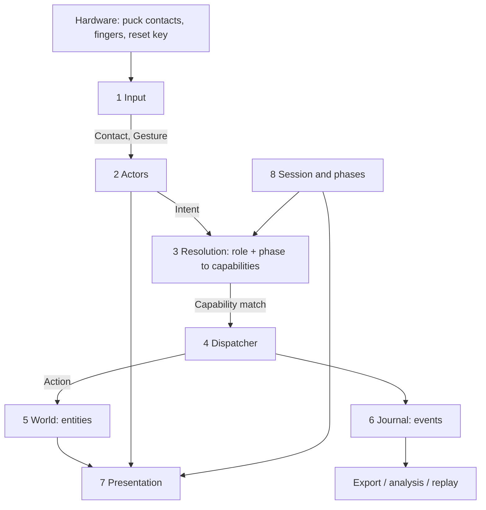

# Architecture — roles, capabilities, actions

Status: design only, nothing implemented. Written to be extended with
roles that do not exist yet.

Decisions taken so far:

- A role is carried by the **puck** and by the **app mode**; puck
  identity fixes the role (a given marker pattern is always a leader).
- Overlap between roles is expressed with **capability objects**, not
  with an inheritance chain. Roles *reference* capabilities.
- **No arbiter yet**: last action wins. Everything still passes one
  dispatcher, so an arbiter can be dropped in without touching
  features.

Defaults assumed where questions are still open are marked
[assumed] and listed again at the bottom.

---

## 1. The eight layers



Rule for the whole document: **a layer only knows the layer above it
by an interface, never by a concrete class.** The UI never asks "is
this a leader"; it asks "does this actor have capability X".

---

## 2. Input layer — hardware becomes intent

Nothing above this layer knows what a puck is made of.

- `Contact` — one physical touch point: id, position, pressure,
  first seen, last seen.
- `ContactCluster` — contacts that belong together (the three or four
  feet of one puck).
- `InputSource` (abstract) — turns raw contacts into a stable
  `SourceHandle` with a pose.
  - `PuckSource` — cluster recognition, marker pattern to stable id,
    position + orientation.
  - `TouchSource` — a lone finger, no identity beyond its zone.
  - `KeySource` — the USB reset button, keyboard shortcuts.
  - `RemoteSource` — [assumed: not built now] a phone or second
    screen; exists as a name so actor identity is never tied to local
    contacts.
- `Gesture` — tap, double tap, long press, drag, rotate, two-finger.
  Produced by `GestureRecognizer` from contacts, never by features.
- `InputSignature` — the declarative description a capability
  publishes ("single tap on a zone", "drag on a marker"). The router
  matches signatures against gestures. **This is what lets a new role
  work without touching the input code.**

Geometry (pose, orientation, hit tests, cluster fitting) lives in the
Rust/wasm crate and is called from here only.

## 3. Actor layer — who is acting

- `Actor` (abstract) — `id`, `presence`, `roleId`, `pose?`,
  `effectiveCapabilities` (cached, recomputed on role or phase
  change).
  - `PuckActor` — bound to a `PuckSource` handle. Role comes from the
    puck identity map.
  - `TouchActor` — bound to a zone, anonymous. [assumed: voters are
    `TouchActor`s and a vote is one-per-zone-per-round, not
    per-person.]
  - `SystemActor` — the table itself: autopull, kiosk recovery,
    timers, phase transitions. Modelled as an actor so automatic
    changes appear in the journal like any other.
  - `RemoteActor` — placeholder, same interface.
- `Presence` — `onTable | lifted | idle | gone`, with `lastSeen`.
  [assumed: an actor **persists** while lifted, so its markers, colour
  and history survive a puck being picked up and put back.]
- `ActorRegistry` — the live set; emits join / leave / role changed.
- `PuckIdentityMap` — one constants file: marker pattern to actor id
  to role id. Physical reality lives in exactly one place.

Duo-pucks: the nesting tool puck is **not** a role. It is a
`CapabilityModifier` on the actor it nests into — it adds or swaps a
capability while nested and removes it when separated. Keeps
`mayOverlap` a physical fact rather than a permission concept.

## 4. Role layer — data, not classes

A role is a **descriptor**, so a new role is a new entry, not new
code.

```
RoleDescriptor
  id            "leader" | "player" | "voter" | ...
  label         display name, per language
  extends       [roleId]        <- reference, the only inheritance
  grants        [CapabilityGrant]
  revokes       [capabilityId]  <- narrowing without a new base
  appearance    ring colour, icon, marker style
```

```
CapabilityGrant
  capabilityId
  scope         own | all | zone | none
  params        capability specific limits
```

- `RoleRegistry` — resolves the `extends` chain into a flat set,
  detects cycles, is the only place that knows role ids.
- Overlap therefore looks like: `leader extends player`, plus grants
  for `map.control`, `session.settings`, `phase.advance`. Shared
  behaviour is one capability object referenced twice, never copied.
- A role you have not thought of yet is added as one descriptor plus,
  at most, one new capability file.

## 5. Capability layer — the shared vocabulary

A `Capability` is a small object, one per file, registered once and
referenced by many roles.

```
Capability (abstract)
  id             "marker.place"
  targets        entity types it can act on
  inputSignature what gesture on what target invokes it
  defaultScope
  menu           label, icon, whether it belongs in a puck ring menu
  canApply(ctx) -> Verdict     allowed / denied(reason)
  buildAction(intent) -> Action
```

Starting vocabulary (each one file):

| id | used by |
| --- | --- |
| `map.control` (pan, zoom, rotate) | leader |
| `map.select` (which map, which layer) | leader |
| `marker.place` | player, leader |
| `marker.edit` (scope own vs all) | player (own), leader (all) |
| `marker.annotate` (text, speech) | player |
| `marker.link` (kg relation) | player, leader |
| `zone.vote` | voter |
| `capture.record` (photo, audio, timelapse) | leader |
| `session.settings` | leader |
| `phase.advance` | leader, system |
| `ui.scale`, `ui.calmMap` | leader |

Design rules:

1. One capability per thing you could ever hand to one role and not
   another. Splitting later is cheap; merging is not.
2. Scope (`own` / `all` / `zone`) is a *grant* property, not a
   separate capability. "Player edits own, leader edits any" is one
   capability, two grants.
3. Capabilities are suspendable: `PhaseGate` can disable
   `marker.place` during a vote without removing it from the role.
4. Capabilities never touch the DOM and never read global state — they
   receive a context and return an action.

`EffectiveCapabilities = resolve(role.extends chain)`
`  ∩ phase.allow  −  phase.deny  −  suspensions`
computed by `PermissionResolver`, cached on the actor.

## 6. Action layer — the single funnel

- `Intent` — "actor A did gesture G on target T". Produced by the
  input layer, carries no permission knowledge.
- `IntentRouter` — finds the one capability in the actor's effective
  set whose `inputSignature` and `targets` match. No match, no
  action, optional feedback ("that puck cannot do this here").
- `Action` (abstract) — a command object: `actorId`, `capabilityId`,
  `target`, payload, `validate(world)`, `apply(world) -> Event[]`.
  Concrete: `PlaceMarkerAction`, `CastVoteAction`, `SetMapViewAction`.
- `ActionDispatcher` — everything goes through here. Today it
  validates and applies immediately (last wins). The seam for later:
  a queue, an `Arbiter` with ownership locks, or leader pre-emption
  can be inserted here alone.
- `Event` — the past tense record of what happened, appended to the
  `Journal`.

Why the funnel matters: undo, session replay, analysis export and any
future conflict rule all become possible without reopening features.

## 7. World layer — the things acted upon

- `Entity` (abstract) — `id`, `type`, `authorId`, `createdAt`,
  `updatedAt`, `geometry?`, `layer`, `meta`.
  - `Marker` — the pin on the map, with notes, media, relations.
  - `Note`, `Recording`, `Photo` — attachments, own entities so they
    can be authored and scoped separately.
  - `Zone` — a votable or restricted area. [assumed: a map polygon,
    not a screen region, so it survives pan and zoom.]
  - `Vote` — references a `Zone` or an `Entity`, plus round id.
  - `Relation` — the knowledge-graph edge between two entities.
  - `MapView` — deliberately an entity, so "the leader controls the
    map" is just `edit` on one singleton entity and needs no special
    permission path.
- `World` — the collections, plus change notification. It holds no
  rules; rules are capabilities.
- Everything is stamped with its author, which is what makes
  `scope: own` possible and what feeds the analysis screen.

## 8. Session and phases — the mode half of a role

```
Session
  id, name, startedAt
  phases    [Phase]
  active    phaseId
  journal   Journal
  actors    snapshot of who took part

Phase
  id            "mapping" | "vote" | "reflect" | "attract"
  allow / deny  capability ids  <- the mode's half of the permission
  roleOverrides optional: in this phase every player becomes a voter
  ui            which panels, which chrome
  endCondition  leader | timer | all zones voted   [assumed: leader]
```

Role and phase **intersect**: an action needs both. A leader in a
vote phase can still not place markers if the phase denies it. This
is what makes the whole table switch behaviour without any actor
changing role.

## 9. Presentation layer — derived, never hardcoded

- `MenuComposer(actor)` builds the puck ring menu from the actor's
  effective capabilities, in menu order. A new capability with
  `menu: true` appears automatically for every role that has it.
- `PanelHost` binds a panel to an entity type plus the capabilities
  the actor has on it — the same marker panel is read-only for one
  actor and editable for another, with no branching per role.
- `ActorSkin` — ring colour, marker style, from the role descriptor.
- Hard rule: **no UI file may mention a role id.** If it needs to, the
  missing thing is a capability.

## 10. Services and platform (unchanged responsibilities, new seams)

`services/` map tiles, speech, capture, storage, export, kg.
`platform/` wasm bridge, kiosk, autopull, reset key.
Both are called *by* actions, never the other way round.

---

## 11. Folder layout

```
src/
  exe/            entry point, composition root, wiring only
  input/          Contact, Gesture, InputSource, signatures
  actors/         Actor and subtypes, registry, presence
  roles/          descriptors (data), RoleRegistry, PuckIdentityMap
  capabilities/   one file per capability, registry, resolver
  actions/        Intent, Action types, dispatcher, journal
  world/          Entity and subtypes, World, collections
  session/        Session, Phase, phase machine
  ui/             composer, panels, canvas layers, scss modules
  services/       speech, capture, tiles, storage, kg, export
  platform/       wasm bridge, kiosk, autopull, reset key
  constants/      ids, config, tuning values
rust/             geometry crate compiled to wasm
```

One symbol per file, 79 columns, 4 spaces, strict TS, SCSS modules.

## 12. How to add things later

| You want | You touch |
| --- | --- |
| A new role | one `RoleDescriptor` entry |
| A role that is "player plus one thing" | `extends: ["player"]` + one grant |
| A new ability | one capability file + register it |
| A new input device | one `InputSource` + one `Actor` subtype |
| A new phase | one `Phase` entry |
| A new kind of thing on the map | one `Entity` subtype + one renderer |
| Conflict handling | `ActionDispatcher` only |
| Multi-device voting | `RemoteSource` + `RemoteActor`, nothing else |

---

## 13. Still open

1. Are finger-only voters anonymous, or do they need identity to stop
   double voting?
2. Is Leader a singleton, or can several leader pucks coexist?
3. Do multiple player pucks need to be distinguishable in the data?
4. Does an actor persist while its puck is lifted? [assumed yes]
5. Capability granularity — is `marker.place` one thing, or
   create/move/annotate/delete separately?
6. Should the phase be able to override a role, or only narrow it?
7. Zones as map polygons or screen regions? [assumed polygons]
8. Journal for every action from day one? [assumed yes — it is the
   cheapest thing to add now and the most expensive to retrofit]
9. Migration: build beside `app.ts` and move features one by one, or
   rewrite once the skeleton stands?
