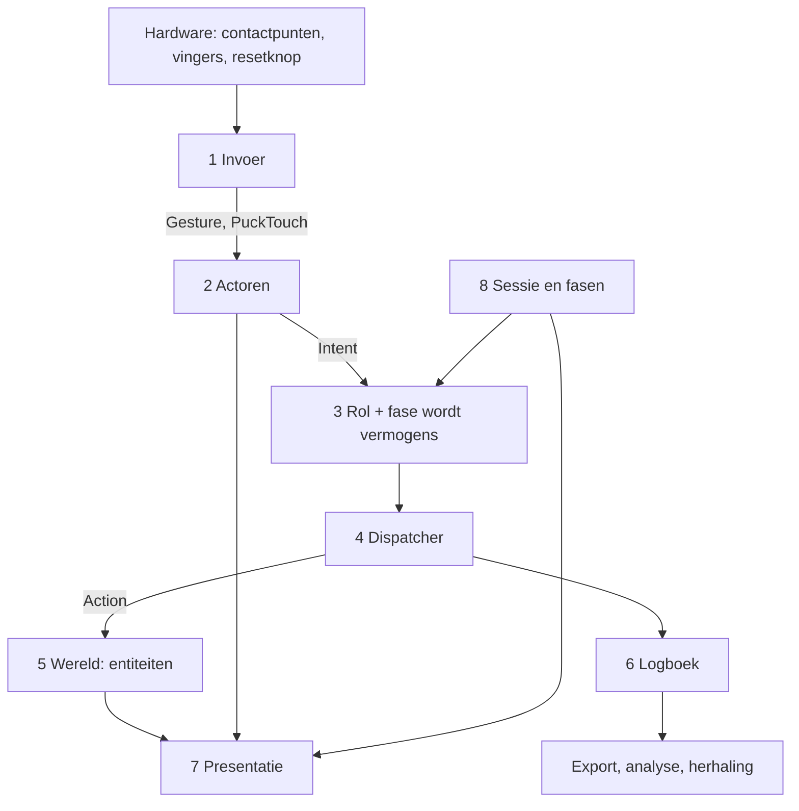

# Architectuur — rollen, vermogens, handelingen

Status: **alleen ontwerp, nog geen code.** Dit stuk beschrijft de laag die
er bovenop de huidige `src/`-indeling komt, zodat rollen die er nu nog niet
zijn later passen zonder de motor open te maken.

Genomen besluiten:

- Een rol hangt aan de **puck** en aan de **modus** van de tafel.
- De puck bepaalt zijn eigen rol: **vaste identiteit**, net zoals
  `Template.verdict` dat nu al doet.
- Overlap tussen rollen leggen we vast met **vermogens als objecten**
  (capabilities), niet met een overervingsketen. Een rol *verwijst* naar
  vermogens.
- **Nog geen scheidsrechter**: laatste handeling wint. Alles loopt wel via
  één dispatcher, zodat een arbiter er later tussen kan zonder dat er aan
  functies getornd wordt.

Aannames die ik zelf heb ingevuld staan als [aanname] en komen onderaan
terug als open vraag.

---

## 1. Wat er nu al staat, en wat er verandert

De tafel kent vandaag één soort deelnemer. `Template.verdict`
(`good | bad | talk | idea`) zegt welke **kleur** een puck is, en overal in
de code wordt daarop getakt. `UiMode` (`touch | laptop | puck`) zegt in wat
voor **omgeving** we draaien.

De verandering in één zin: `verdict` wordt één eigenschap van een puck naast
zijn **rol**, en `UiMode` krijgt een broertje — de **fase** van de sessie.
Wat een puck mág doen komt niet meer uit een `if` op zijn soort, maar uit
een verzameling vermogens.

| Nu | Straks |
| --- | --- |
| `Template.verdict` bepaalt wat de puck doet | `Template.roleId` bepaalt dat; `verdict` is alleen nog de soort markering |
| `RingItem[]` met de hand samengesteld | afgeleid uit de vermogens van die actor |
| `if (mode === "puck")` verspreid door de UI | `phase.allow` / `phase.deny` op één plek |
| een handeling roept direct `movePinTo` aan | een `Action` roept `movePinTo` aan, en de dispatcher roept de `Action` aan |

De functionele stijl blijft: **één symbool per bestand**. De nieuwe laag is
het enige stuk dat klassen gebruikt (een vermogen is een klasse), en die
klassen doen het werk niet zelf — ze roepen de bestaande functies aan.

## 2. De acht lagen



De regel voor het hele stuk: **een laag kent de laag erboven alleen via een
interface, nooit via een concrete klasse.** De UI vraagt nooit "is dit een
leider", de UI vraagt "heeft deze actor vermogen X".

---

## 3. Invoer — hardware wordt een bedoeling

Bestaat grotendeels al: `src/input/`, `src/puck/`, `src/types/Gesture.ts`,
`TouchPoint.ts`, `PuckTouch.ts`, `Track.ts`, en de meetkunde in
`src/wasm/puck-geometry/`. Wat erbij komt is één begrip:

- `InputSignature` — de beschrijving die een vermogen zelf publiceert
  ("enkele tik op een zone", "sleep op een markering", "draai aan de ring").
  De router legt binnenkomende gebaren naast die beschrijvingen.
  **Dit is wat maakt dat een nieuwe rol werkt zonder dat `src/input/`
  wordt aangeraakt.**
- `InputSource` (abstract) — wat contactpunten omzet in een handvat met een
  houding. Concreet: `PuckSource` (bestaat al als
  `recognisePucks` + `tracks`), `TouchSource` (losse vinger, geen
  identiteit), `KeySource` (de resetknop, `src/ui/resetKey/`),
  `RemoteSource` — [aanname: nu niet bouwen] telefoon of tweede scherm,
  alleen als naam aanwezig zodat actor-identiteit nooit aan lokale
  contactpunten vastzit.

## 4. Actoren — wie er handelt

Nieuw: `src/actors/`.

```
Actor (abstract)
  id
  presence          onTable | lifted | idle | gone
  roleId
  pose?             positie en hoek (uit de wasm-meetkunde)
  side              Side, welke tafelkant hij hoort
  capabilities()    de effectieve verzameling, gecachet
```

- `PuckActor` — hangt aan een herkende puck (`Track` + `Template`).
- `TouchActor` — hangt aan een zone, anoniem.
  [aanname: stemmers zijn `TouchActor`s en een stem is één per zone per
  ronde, niet per persoon.]
- `SystemActor` — de tafel zelf: de bijwerker, kioskherstel, tijden, het
  omzetten van fasen. Als actor gemodelleerd zodat automatische
  veranderingen net zo in het logboek staan als handmatige.
- `RemoteActor` — plaatshouder, zelfde interface.

`ActorRegistry` — de levende verzameling; meldt erbij, eraf, rol gewijzigd.
[aanname: een actor **blijft bestaan** zolang zijn puck is opgetild, met
zijn markeringen, kleur en geschiedenis, en pakt de draad op als de puck
terugkomt.]

**Duo-pucks.** De insteekpuck is géén rol. Hij is een `CapabilityModifier`
op de actor waarin hij ligt: zolang hij nestelt voegt hij een vermogen toe
of wisselt hij er een om, en bij loshalen verdwijnt dat weer. Zo blijft
`mayOverlap` een natuurkundig feit en wordt het geen rechtenbegrip.

## 5. Rollen — gegevens, geen klassen

Nieuw: `src/roles/`. Een rol is een **beschrijving**, zodat een nieuwe rol
een nieuwe regel is en geen nieuwe code.

```
RoleDescriptor
  id          "leader" | "player" | "voter" | ...
  label       weergavenaam per taal (via src/i18n)
  extends     [roleId]          <- verwijzing; de enige overerving
  grants      [CapabilityGrant]
  revokes     [capabilityId]    <- versmallen zonder nieuwe basis
  appearance  ringkleur, pictogram, markeringsstijl
```

```
CapabilityGrant
  capabilityId
  scope     own | all | zone | none
  params    grenzen die bij dat vermogen horen
```

- `RoleRegistry` — vlakt de `extends`-keten uit, ziet kringen, en is de
  enige plek die rol-id's kent.
- Overlap ziet er dan zo uit: `leader extends player`, plus toekenningen
  voor `map.control`, `session.settings`, `phase.advance`. Gedeeld gedrag is
  één vermogensobject waar twee rollen naar wijzen — nooit een kopie.
- `PuckIdentityMap` — één constantenbestand: driehoekpatroon → actor-id →
  rol-id. De natuurkundige werkelijkheid staat op precies één plek. Dit is
  de generalisatie van de vier ingemeten `Template`s van nu.

## 6. Vermogens — de gedeelde woordenschat

Nieuw: `src/capabilities/`, **één klasse per bestand**.

```
Capability (abstract)
  id              "pin.place"
  targets         entiteitsoorten waar het op werkt
  inputSignature  welk gebaar op welk doel dit oproept
  defaultScope
  menu            label, pictogram, hoort dit in het ringmenu
  canApply(ctx)   -> allowed | denied(reden)
  buildAction(intent) -> Action
```

Beginwoordenschat (elk één bestand), met wat er nu al voor bestaat:

| id | roept aan | wie |
| --- | --- | --- |
| `map.control` (pannen, zoomen, draaien) | `src/map/` | leider |
| `map.select` (welke ondergrond, welke laag) | `basemaps`, `tiles` | leider |
| `pin.place` | `pinAt`, `save` | speler, leider |
| `pin.move` | `movePinTo` | speler (own), leider (all) |
| `pin.annotate` (tekst, spraak) | `src/notes/`, `src/talk/` | speler |
| `pin.link` (kg-relatie) | `src/kg/` | speler, leider |
| `zone.vote` | nieuw | stemmer |
| `capture.record` (foto, opname, tijdlapse) | `capture` | leider |
| `session.settings` | `src/ui/panels/` | leider |
| `phase.advance` | nieuw | leider, systeem |
| `ui.scale`, `ui.calmMap` | `stepScale`, `calmMap` | leider |

Ontwerpregels:

1. Eén vermogen per ding dat je ooit aan de ene rol wél en aan de andere
   niet zou geven. Later splitsen is goedkoop, samenvoegen niet.
2. Bereik (`own` / `all` / `zone`) is een eigenschap van de **toekenning**,
   niet een apart vermogen. "Speler bewerkt de eigen markering, leider elke"
   is één vermogen met twee toekenningen.
3. Vermogens zijn tijdelijk stil te zetten: een fase kan `pin.place`
   uitzetten tijdens een stemronde zonder het uit de rol te halen.
4. Een vermogen raakt de DOM niet en leest geen globale toestand: het
   krijgt een context mee en geeft een handeling terug.

```
EffectiveCapabilities =
    resolve(rol, met extends)
  ∩ phase.allow  −  phase.deny  −  tijdelijk stilgezet
```
berekend door `PermissionResolver`, gecachet op de actor, opnieuw berekend
bij rolwissel en fasewissel.

## 7. Handelingen — de ene trechter

Nieuw: `src/actions/`.

- `Intent` — "actor A deed gebaar G op doel T". Komt uit de invoerlaag en
  weet niets van rechten.
- `IntentRouter` — zoekt het ene vermogen in de effectieve verzameling
  waarvan `inputSignature` en `targets` passen. Geen treffer, geen
  handeling (met eventueel een zichtbare weigering).
- `Action` (abstract) — een opdrachtobject: `actorId`, `capabilityId`,
  `target`, lading, `validate(world)`, `apply(world) -> Event[]`. Concreet
  `PlacePinAction`, `CastVoteAction`, `SetMapViewAction`; die roepen de
  bestaande functies aan, ze vervangen ze niet.
- `ActionDispatcher` — alles gaat hierlangs. Nu: nakijken en meteen
  toepassen, laatste wint. De naad voor later: een wachtrij, een `Arbiter`
  met eigendom, of voorrang voor de leider — allemaal alléén hier.
- `Event` + `Journal` — wat er gebeurd is, in verleden tijd, achter elkaar
  weggeschreven.

Waarom die trechter de moeite waard is: ongedaan maken, een sessie
terugspelen, de analyse en élke latere botsingsregel worden mogelijk zonder
één functie open te maken. [aanname: vanaf dag één meeschrijven — het is nu
het goedkoopst en achteraf het duurst.]

## 8. Wereld — waar op gehandeld wordt

Bestaat deels: `src/pins/`, `src/notes/`, `src/kg/`, `src/map/`. Wat erbij
komt is een gedeelde basis, zodat vermogens algemeen kunnen zijn
(`Create<T>`, `Edit<T>`) in plaats van één per functie.

```
Entity (abstract)
  id, type, authorId, createdAt, updatedAt, layer, meta
```

- `Pin` — bestaat al; krijgt `authorId` erbij. Dát maakt `scope: own`
  mogelijk en voedt de analyse.
- `Note`, `Recording`, `Photo` — nu velden op een pin, straks eigen
  entiteiten, zodat ze apart toegekend en beschermd kunnen worden.
- `Zone` — een stembaar of afgeschermd gebied.
  [aanname: een veelhoek op de kaart, geen schermgebied, zodat hij pannen en
  zoomen overleeft.]
- `Vote` — verwijst naar een `Zone` of een `Entity`, plus ronde-id.
- `Relation` — de kg-verbinding tussen twee entiteiten.
- `MapView` — met opzet óók een entiteit, zodat "de leider bestuurt de
  kaart" gewoon `edit` op één entiteit is en geen eigen rechtenpad nodig
  heeft.

`World` houdt de verzamelingen bij en meldt wijzigingen. Er zitten geen
regels in; de regels zijn de vermogens.

## 9. Sessie en fasen — de andere helft van een rol

Nieuw: `src/session/`. Dit is de generalisatie van `UiMode`.

```
Session
  id, name, startedAt, phases, active, journal, actors

Phase
  id             "mapping" | "vote" | "reflect" | "attract"
  allow / deny   vermogens-id's  <- de helft van de rechten die van de modus komt
  roleOverrides  optioneel: in deze fase is elke speler een stemmer
  ui             welke panelen, welke chrome
  endCondition   leider | tijd | alle zones gestemd   [aanname: leider]
```

Rol en fase **snijden**: een handeling heeft beide nodig. Een leider mag in
een stemfase geen markering plaatsen als de fase dat weigert. Zo wisselt de
hele tafel van gedrag zonder dat één actor van rol verandert.

## 10. Presentatie — afgeleid, nooit vastgetimmerd

- `MenuComposer(actor)` bouwt `RingItem[]` uit de vermogens van die actor.
  Een nieuw vermogen met `menu: true` verschijnt vanzelf bij elke rol die
  het heeft.
- `PanelHost` bindt een paneel aan een entiteitsoort plus de vermogens die
  deze actor daarop heeft: hetzelfde markeringsvenster is voor de een
  alleen-lezen en voor de ander bewerkbaar, zonder aftakking per rol.
- `ActorSkin` — ringkleur en markeringsstijl uit de rolbeschrijving.
- Harde regel: **geen enkel bestand in `src/ui/` noemt een rol-id.** Moet
  het toch, dan ontbreekt er een vermogen.

## 11. Mappen

Bestaand blijft staan; nieuw ernaast:

```
src/
  actors/         Actor + soorten, registry, presence
  roles/          beschrijvingen (gegevens), RoleRegistry, PuckIdentityMap
  capabilities/   één vermogen per bestand, registry, resolver
  actions/        Intent, Action-soorten, dispatcher, journal
  session/        Session, Phase, de fasemachine
  world/          Entity-basis, Zone, Vote (Pin blijft in pins/)
  input/ puck/ map/ pins/ notes/ kg/ ui/ render/ state/ types/ …  ongewijzigd
```

Eén symbool per bestand, 79 kolommen, 4 spaties, strict TS, modulaire SCSS.

## 12. Hoe je er later iets bij zet

| Je wilt | Je raakt aan |
| --- | --- |
| een nieuwe rol | één `RoleDescriptor` |
| "speler plus één ding" | `extends: ["player"]` + één toekenning |
| een nieuw vermogen | één bestand in `capabilities/` + registreren |
| een nieuw invoerapparaat | één `InputSource` + één `Actor`-soort |
| een nieuwe fase | één `Phase` |
| een nieuw ding op de kaart | één `Entity`-soort + één tekenfunctie |
| botsingen afhandelen | alleen `ActionDispatcher` |
| stemmen op telefoons | `RemoteSource` + `RemoteActor`, verder niets |

## 13. Volgorde van invoeren (wurgvijg, geen herschrijving)

1. `Entity`-basis + `authorId` op `Pin`. Verandert niets zichtbaars.
2. `src/actions/`: `Action` + dispatcher + logboek, met twee bestaande
   handelingen (markering plaatsen, markering verplaatsen) erdoorheen.
3. `src/actors/`: `PuckActor` om de bestaande `Track` heen; nog één rol
   ("player") voor iedereen.
4. `src/capabilities/` + `src/roles/`: de huidige ringmenu-items worden
   vermogens; `MenuComposer` vervangt de handgemaakte `RingItem[]`.
5. `src/session/`: `Phase` erbij, `UiMode` blijft wat het is (omgeving).
6. Pas dan: `leader`, `voter`, `TouchActor`, `Zone`, `Vote`.

Stap 1–4 verandert geen gedrag en is los te testen met de rooktest.

## 14. Nog open

1. Zijn stemmers met alleen een vinger anoniem, of moeten ze te
   onderscheiden zijn om dubbel stemmen te voorkomen?
2. Is er precies één leider, of mogen er meerdere leiderpucks tegelijk
   liggen?
3. Moeten meerdere spelerpucks in de gegevens uit elkaar te houden zijn
   (speler A vs speler B), of is "een speler" genoeg?
4. Blijft een actor bestaan als zijn puck van tafel is? [aanname: ja]
5. Korrelgrootte: is `pin.place` één ding, of plaatsen/verplaatsen/
   toelichten/verwijderen apart?
6. Mag een fase een rol **overschrijven**, of alleen versmallen?
7. Zones als kaartveelhoek of als schermgebied? [aanname: veelhoek]
8. Vanaf dag één alles in het logboek? [aanname: ja]
9. Blijft `Template.verdict` bestaan naast `roleId`, of wordt de soort
   markering iets wat je in het ringmenu kiest?
